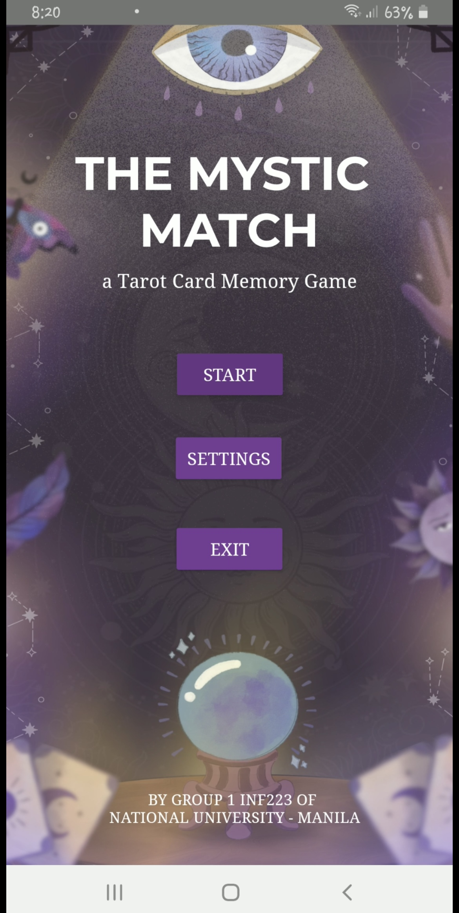
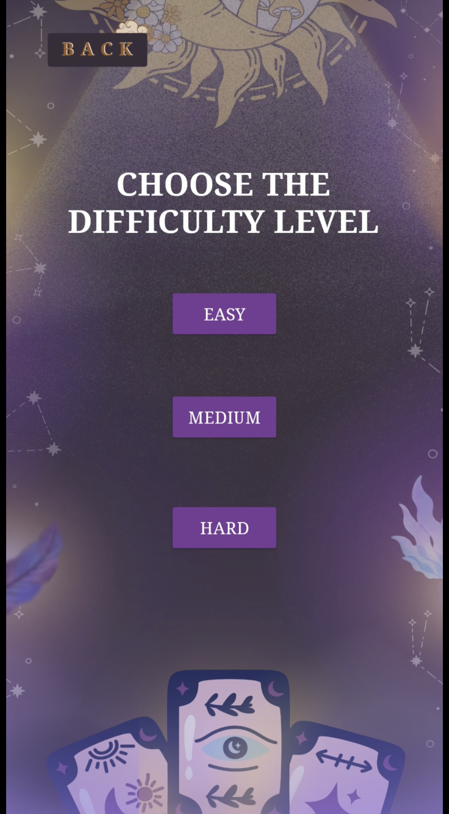
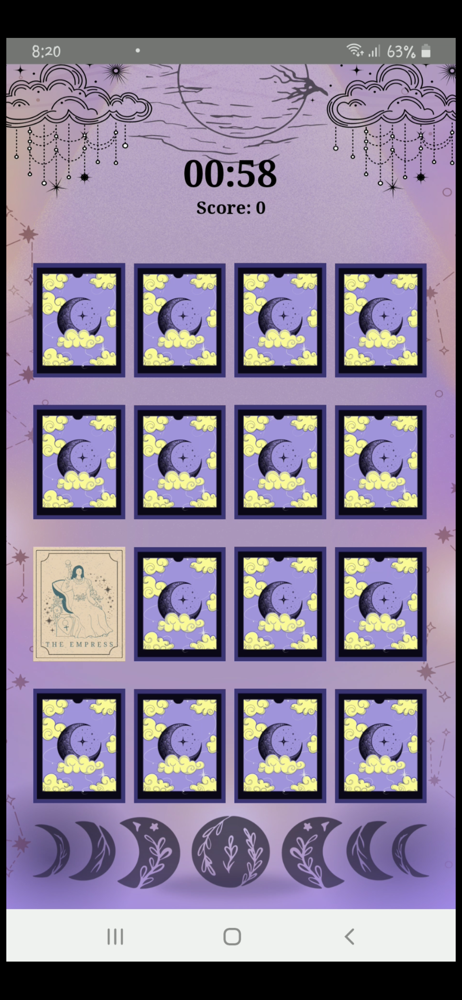
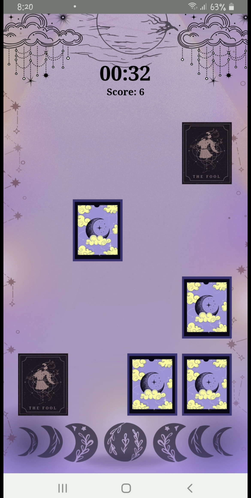
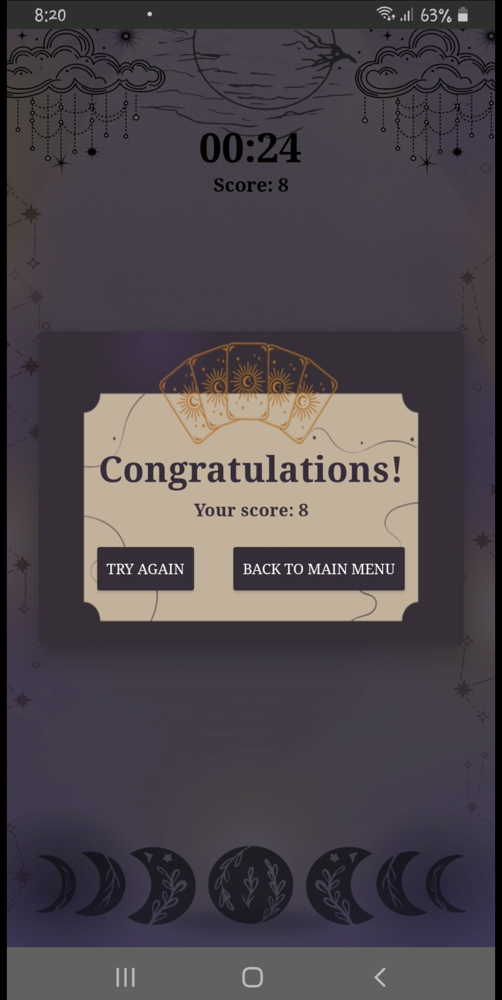

# 🧠 The Mystic Match

**The Mystic Match** is a fun and engaging **memory card game** built using **Java** in **Android Studio**.
Test your memory skills by matching pairs of cards as quickly as possible!

---

## 🎮 Gameplay Overview

Flip and match pairs of cards hidden under a mystical theme.
Challenge yourself to remember card positions and complete the board before the timer runs out.

---

## ✨ Features

* 🎴 Classic **memory matching gameplay**
* 🧮 **Easy, Medium, and Hard** modes
* 🔁 **Restart & reset** functionality

---

## 🛠️ Built With

* **Language:** Java
* **IDE:** Android Studio
* **Framework:** Android SDK
* **UI:** XML layouts and Android Views

---

## 📦 Installation & Setup

1. **Clone the repository**

   ```bash
   git clone https://github.com/arlln-yn/The-Mystic-Match.git
   cd The-Mystic-Match
   ```

2. **Open in Android Studio**

   * Go to *File → Open...*
   * Select the project folder
   * Let Android Studio sync Gradle files

3. **Build and Run**

   * Connect an Android device or use an emulator
   * Click ▶️ *Run* in Android Studio

---

## 📸 App Screenshots

<p align="center">
  
  
</p>

<p align="center">
   
   
   
</p>

---

## 📲 Download

👉 [**Download The Mystic Match APK**](#)
*(Insert download link above)*

---

## 📁 Project Structure

```
app/
├── java/com/example/themysticmatch/   # Java source code (activities, logic)
├── res/                               # UI layouts, drawables, and resources
├── AndroidManifest.xml                # App configuration
└── build.gradle                       # Gradle setup
```

---

## 🧑‍💻 Author

**Arlln-yn**
🎮 Academic Project
🔗 GitHub: [@arlln-yn](https://github.com/arlln-yn)
